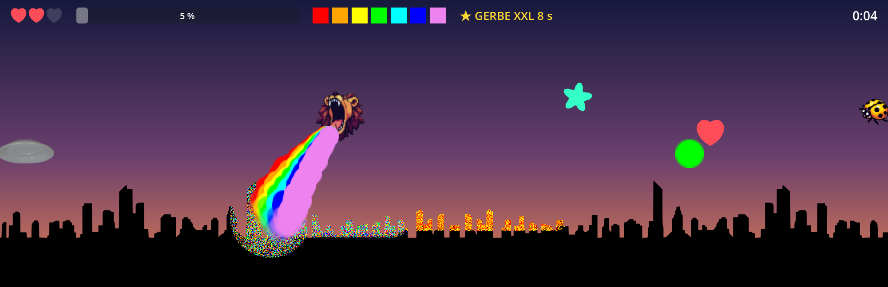
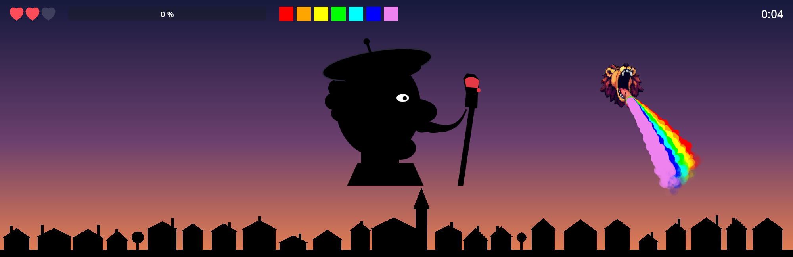

# LeLion

[Original inspiration: Laetitia Perez](https://www.instagram.com/p/Dc3SacQDsyM/?igsi=M21jMzRiMmxqdTZl)

A lion has to paint the town by puking a rainbow, while dodging enemies.
An absurd, deliciously colorful game made with [Godot 4](https://godotengine.org).

**Play in your browser: <https://w3cdotorg.github.io/LeLion/>** (deployed by CI on every push to `main`).





## How to play

Grab the color dots to enrich your spew, then hold the puke button while flying over the town.
You win once enough of the skyline is really covered in paint: 85% on Easy, 90% on Normal,
95% on Hardcore. A yellow tick on the progress bar marks the finish line. Enemies hurt: a saucer or a ladybug costs you a
heart, and they show up faster and faster as the town gets colored.

On the title screen, pick a difficulty: **Easy** (3 hearts, extra hearts respawn, paint 85%),
**Normal** (3 hearts, no extras, paint 90%) or **Hardcore** (one hit and it's over, paint 95%). After a hit, the lion blinks and
stays invulnerable for a second and a half. Pick one of three levels (Skyline, Metropolis,
Village), each showing your best time for the chosen difficulty, then press **Play**. In the Village, a
giant painter joins in: he announces himself on one side of the screen, moves to the center,
pauses, backs out, then comes back from the other side. Paint the half he leaves free, cross
over when he retreats.

A rainbow star appears from time to time: grab it to double the width of your spew for eight
seconds.

| Action | Keyboard | Gamepad | Touch screen |
|---|---|---|---|
| Move | Arrows, WASD / ZQSD | Left stick, D-pad | Virtual stick: put your thumb on the left half |
| Puke | Space, Enter | A | PUKE button, bottom right |
| Pause (Resume / Settings / Back to menu) | Esc, P | Start | II button, top right |

Touch controls only appear on devices with a touch screen. The **Settings** screen (title
screen or pause menu) has music and sound-effect volumes, fullscreen, an optional CRT filter
(scanlines, curvature, color bleed) and the language (French or English; the default follows
your system). Difficulty, last level, settings and best
times are all saved between sessions: on the web build they live in the browser's IndexedDB,
so they survive closing the tab.

## Running the game

Open the folder in Godot 4.4 or newer and run the main scene, or from the command line:

```sh
godot .
```

## Project layout

```
Scenes/     Titre (title), Main (a game), Lion, Ville (town), HUD, PauseMenu, Reglages (settings),
            ControlesTactiles (touch controls), GameOver, ColorPickup, BonusPickup, CoeurPickup,
            Soucoupe, Coccinelle, Boss
Scripts/    one script per scene + autoloads GameState (game, lives, levels, difficulties),
            Scores (records, preferences), Parametres (settings), Audio (sounds, music)
Shaders/    Ville.gdshader: applies the paint mask to the skyline
Assets/     Sprites (used), Sons (generated), Traductions (CSV → .translation), src (reference material, ignored by Godot)
tests/      smoke_test.gd (headless) and screenshots.gd (scripted captures)
tools/      generer_sons.py (effects), generer_musique.py (layered chiptune, town + boss themes), generer_skylines.py (skylines, sprites)
```

The paint is an RGBA mask the size of the skyline, stamped through a native blit wherever the
spew touches the town. Progress is counted on an 8 px cell grid that only covers the opaque
parts of the skyline. A level is just a silhouette PNG: add an entry to `GameState.NIVEAUX` to
create one, with `"boss": true` to invite the painter. His collision is generated from the alpha
of his SVG sprite, so replacing `Assets/Sprites/boss_peintre.svg` is enough to change his shape.

Code identifiers and comments are in French; player-facing text goes through Godot's
translation system, with both languages in `Assets/Traductions/traductions.csv`.

## Tests

The smoke test loads the main scene without a display, unlocks a color, makes the lion puke on
the town, triggers a defeat and then a victory, and exercises the title screen, settings, touch
controls and the boss:

```sh
godot --headless --script tests/smoke_test.gd
```

For a visual check (opens a window for a few seconds and writes PNGs):

```sh
godot --rendering-driver opengl3 --script tests/screenshots.gd -- --dossier=/output/path
```

Sounds are regenerated with `python3 tools/generer_sons.py`, the music with
`python3 tools/generer_musique.py`, skylines and sprites with `python3 tools/generer_skylines.py`.

## Export and CI

A Web preset is defined in `export_presets.cfg`. With the export templates installed:

```sh
godot --headless --export-release Web export/web/index.html
```

The workflow in `.github/workflows/ci.yml` installs Godot, runs the smoke test and exports the
Web build on every push and pull request. On `main`, it deploys the result to GitHub Pages.
